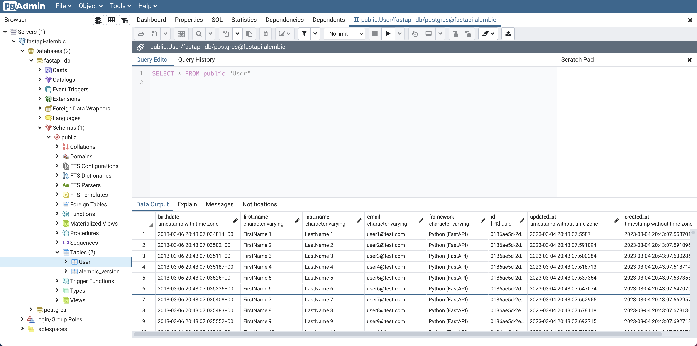
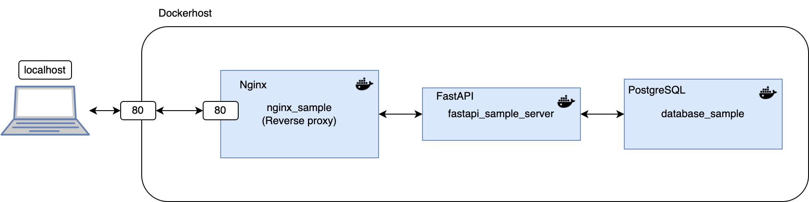
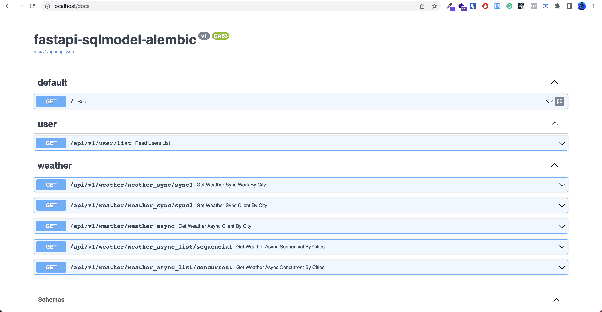

# FastAPI Async Sample

This is a project template which uses [FastAPI](https://fastapi.tiangolo.com/), PostgreSQL database and async [SQLModel](https://sqlmodel.tiangolo.com/) as ORM.

## Set environment variables

Create an **.env** file on root folder and copy the content from **.env.example**. Feel free to change it according to your own configuration.

## Run the project using Docker containers and forcing build containers

*Using docker compose command*
```sh
docker compose -f docker-compose-dev.yml up --build
```

*Using Makefile command*
```sh
make run-dev-build
```

## Run project using Docker containers

*Using docker compose command*
```sh
docker compose -f docker-compose-dev.yml up
```

*Using Makefile command*
```sh
make run-dev
```

This starts the server at [http://localhost](http://localhost) using nginx as reverse proxy. If you want a direct connection bypassing the proxy, you can use this url [http://localhost:8000](http://localhost:8000).

## Setup database with initial data
This creates sample users on database.

*Using docker compose command*
```
docker compose -f docker-compose-dev.yml exec fastapi_server python app/initial_data.py
```

*Using Makefile command*
```sh
make init-db
```

You can connect to the Database using pgAdmin4 and use the credentials from .env file. Database port on local machine has been configured to **5454** on docker-compose-dev.yml file

(Optional) If you prefer you can run pgAdmin4 on a docker container using the following commands, they should executed on different terminals:

*Starts pgadmin*
```sh
make run-pgadmin
```

*Load server configuration (It is required just the first time)*
```sh
make load-server-pgadmin
```

This starts pgamin in [http://localhost:15432](http://localhost:15432).

<p align="center">
  
</p>

## Containers architecture
<p align="center">
  
</p>


## Preview
<p align="center">
  
</p>


## Production Deployment

*Using docker compose command*
```sh
docker compose up
```

*Using Makefile command*
```sh
make run-prod
```

## License

[](http://badges.mit-license.org)

- This project is licensed under the terms of the **[MIT license](LICENSE)**
